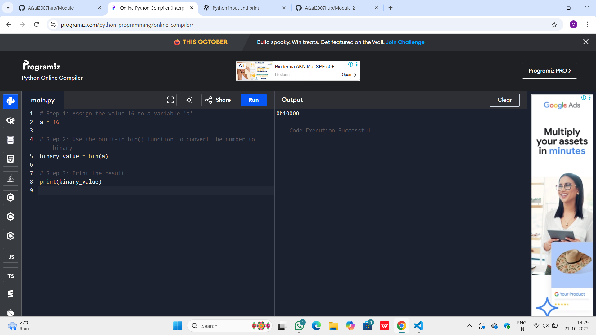
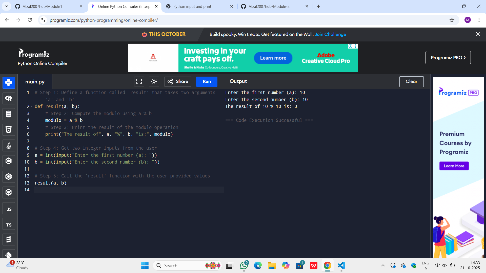
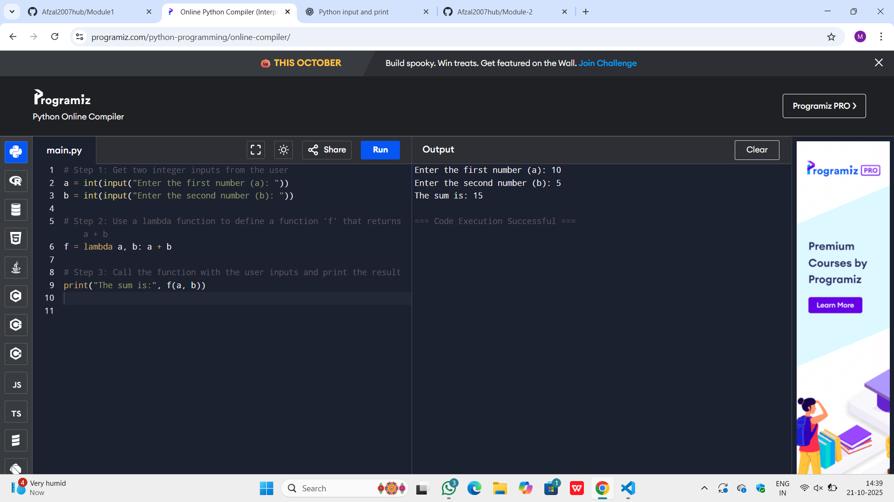
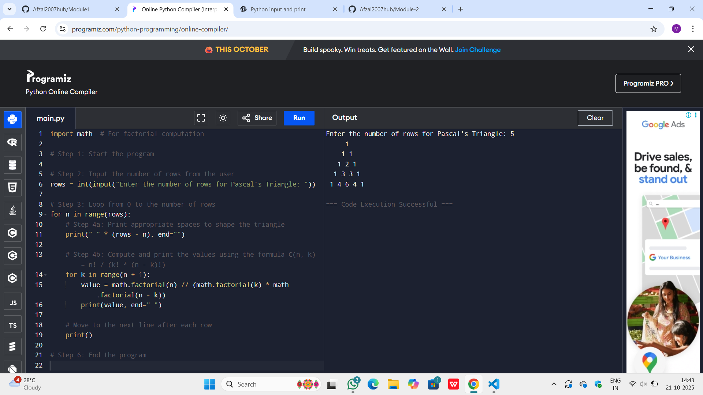
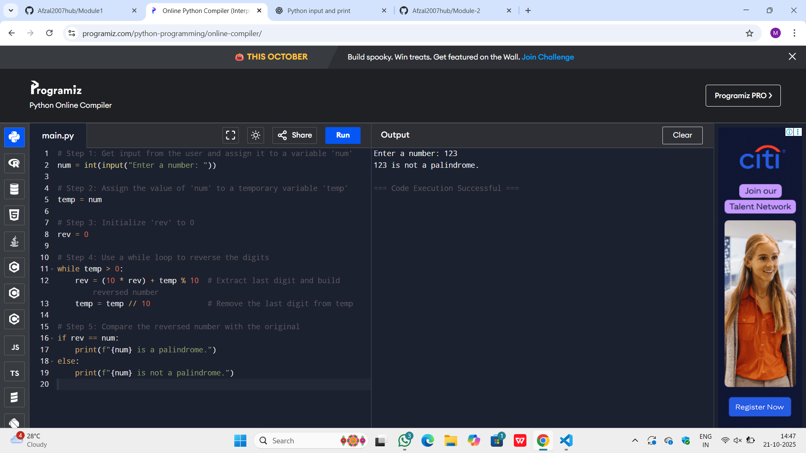

# Built-in Functions -Binary Conversion Using Built-in Functions in Python

## 🎯 Aim
To write a Python program to convert the number **16** into its **binary representation** using built-in Python functions.

## 🧠 Algorithm
1. Assign the value `16` to a variable `a`.
2. Use the built-in `bin()` function to convert the number to binary.
3. Print the result.

## 🧾 Program
~~~
a = 16

binary_value = bin(a)

print(binary_value)
~~~

## Output

## Result
The given program is successfully executed

# Functions in Python: Modulo Calculator

## 🎯 Aim
To write a Python program that defines a function which accepts two values and returns their **modulo** using the `%` operator.

## 🧠 Algorithm
1. Define a function called `result` that takes two arguments `a` and `b`.
2. Inside the function, compute the modulo using `a % b`.
3. Print the result of the modulo operation.
4. Get two integer inputs from the user.
5. Call the `result` function with the user-provided values.

## 🧾 Program
~~~
def result(a, b):
    # Step 2: Compute the modulo using a % b
    modulo = a % b
    # Step 3: Print the result of the modulo operation
    print("The result of", a, "%", b, "is:", modulo)

a = int(input("Enter the first number (a): "))
b = int(input("Enter the second number (b): "))

result(a, b)

~~~
## Output

## Result
The given program is successfully executed

# Lambda Function in Python: Addition of Two Numbers

## 🎯 Aim
To write a Python program that defines a **lambda function** which takes two arguments `a` and `b`, and returns their sum.

## 🧠 Algorithm
1. Get two integer inputs from the user.
2. Use a **lambda function** to define a function `f` that returns `a + b`.
3. Call the function with the user inputs and print the result.

## 🧾 Program
~~~
a = int(input("Enter the first number (a): "))
b = int(input("Enter the second number (b): "))

f = lambda a, b: a + b

print("The sum is:", f(a, b))
~~~

## Output

## Result
The given program is successfully executed

# 🔺 Looping(Patterns)-Pascal's Triangle Generator in Python

This project demonstrates a simple Python program to generate **Pascal’s Triangle**, where the number of rows is provided by the user.

---

## 🎯 Aim

To write a Python program that generates **Pascal's Triangle** using numbers. The number of rows is accepted from the user.

---

## 🧠 Algorithm

1. Start the program.
2. Input the number of rows from the user.
3. Loop from 0 to the number of rows.
4. For each row:
   - Print appropriate spaces to shape the triangle.
   - Compute values using the formula:  
     \[
     C(n, k) = \frac{n!}{k!(n-k)!}
     \]
5. Print all rows of Pascal’s Triangle.
6. End the program.

---

## 🧪 Program
~~~
import math  
rows = int(input("Enter the number of rows for Pascal's Triangle: "))

for n in range(rows):

    print(" " * (rows - n), end="")
    for k in range(n + 1):
        value = math.factorial(n) // (math.factorial(k) * math.factorial(n - k))
        print(value, end=" ")

    
    print()
~~~

## Sample Output

## Result
The given program is successfully executed

## Loops in Python: Palindrome Number Checker

## 🎯 Aim
To write a Python program that checks whether a given number is a **palindrome** using loops.

## 🧠 Algorithm
1. Get input from the user and assign it to a variable `num`.
2. Assign the value of `num` to a temporary variable `temp`.
3. Initialize a variable `rev` to 0 (used to store the reversed number).
4. Use a `while` loop to reverse the digits:
   - While `temp > 0`:
     - `rev = (10 * rev) + temp % 10`
     - `temp = temp // 10`
5. After the loop, compare `rev` with `num`:
   - If equal, print that the number is a palindrome.
   - Else, print that it is not a palindrome.

## 🧾 Program
~~~
num = int(input("Enter a number: "))

temp = num

rev = 0

while temp > 0:
    rev = (10 * rev) + temp % 10  # Extract last digit and build reversed number
    temp = temp // 10             # Remove the last digit from temp

if rev == num:
    print(f"{num} is a palindrome.")
else:
    print(f"{num} is not a palindrome.")

~~~
## Output

## Result
The given program is successfully executed

